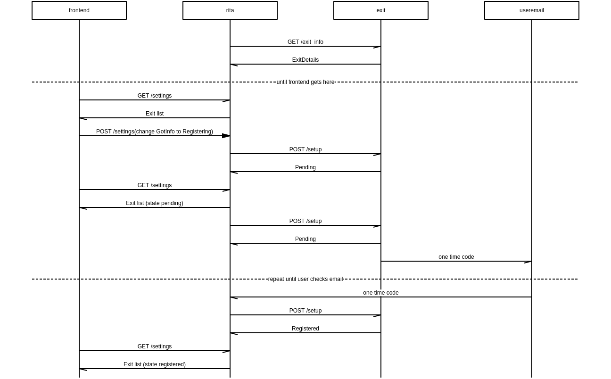

```msc
msc {
  hscale = "2";

  frontend,rita,exit,useremail;

  rita->exit [ label = "GET /exit_info" ] ;
  rita<-exit [ label = "ExitDetails" ] ;

  ---  [ label = "until frontend gets here" ];

  frontend->rita [ label = "GET /settings" ] ;
  frontend<-rita [ label = "Exit list" ] ;

  frontend=>rita [ label = "POST /settings(change GotInfo to Registering)" ] ;

  rita->exit [ label = "POST /setup" ] ;
  rita<-exit [ label = "Pending" ] ;

  frontend->rita [ label = "GET /settings" ] ;
  frontend<-rita [ label = "Exit list (state pending)" ] ;

  rita->exit [ label = "POST /setup" ] ;
  rita<-exit [ label = "Pending" ] ;

  exit->useremail [ label = "one time code" ] ;

  ---  [ label = "repeat until user checks email" ];

  rita<-useremail [ label = "one time code" ] ;

  rita->exit [ label = "POST /setup" ] ;
  rita<-exit [ label = "Registered" ] ;

  frontend->rita [ label = "GET /settings" ] ;
  frontend<-rita [ label = "Exit list (state registered)" ] ;

  ---  [ label = "every 5 seconds" ];

    rita->exit [ label = "POST /status" ] ;
    rita<-exit [ label = "state: Registered/New/GotInfo" ] ;
}
```